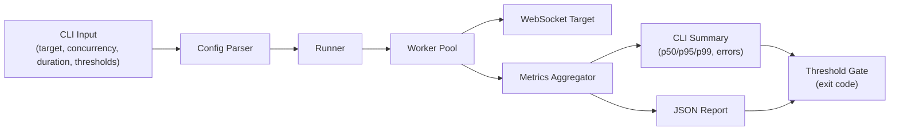

# wsblast

`wsblast` is a Rust-native WebSocket load-testing CLI focused on CI-friendly results and clear latency/error reporting.

## Why

After shipping [Echo](https://github.com/jephter-olamiposi/Echo), I wanted a tighter way to stress-test real-time WebSocket paths and inspect failure patterns quickly while iterating.

`wsblast` is being built to make that workflow practical for Rust backend teams.

## Architecture Sketch

Planned v0.1 flow:



## Quick Start

```bash
git clone https://github.com/jephter-olamiposi/wsblast.git
cd wsblast
cargo run
```

Current output:

```text
wsblast project structure initialized
```

## Usage

For now, usage is scaffold-only while core load-testing logic is being implemented.

- Run scaffold binary: `cargo run`
- Build release binary: `cargo build --release`
- Run checks: `cargo check`

## Output / Example

Initial scaffold behavior:

```bash
cargo run
```

```text
wsblast project structure initialized
```

Target v0.1 output (planned):
- latency summary (`p50/p95/p99`)
- error summary by category
- JSON report for CI
- threshold pass/fail exit code

## Roadmap

### v0.1 Scope

- CLI runner for WebSocket load sessions
- Concurrency + duration controls
- Percentile latency summary (`p50/p95/p99`)
- Error summary by type
- JSON output for CI pipelines
- Exit codes for pass/fail test thresholds

### v0.1 Non-Goals

- Full TUI dashboard
- Distributed/multi-node execution
- Complex scenario DSL
- Performance claims against other tools

### Milestones

1. Build single-target WS run flow with stable summary output.
2. Add threshold-based CI gating and structured JSON reports.
3. Add reproducibility metadata for run-to-run comparison.
4. Expand metrics depth and scenario support in follow-up versions.

## Contributing

Contributions and feedback are welcome.

- Open an issue for bug reports and feature requests.
- Keep PRs focused and small.
- Run `cargo check` before opening a PR.

## Planned Structure

```text
src/
  main.rs
  cli.rs
  config.rs
  runner.rs
  worker.rs
  metrics.rs
  report.rs
  tui/
    mod.rs
    app.rs
    widgets.rs
```

## License

MIT. See [LICENSE](LICENSE).
