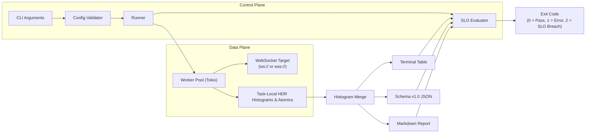
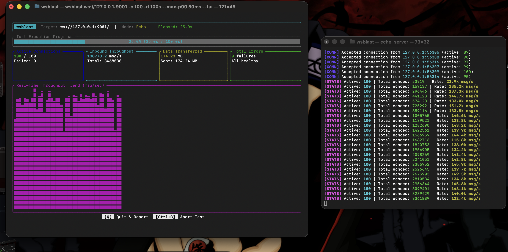
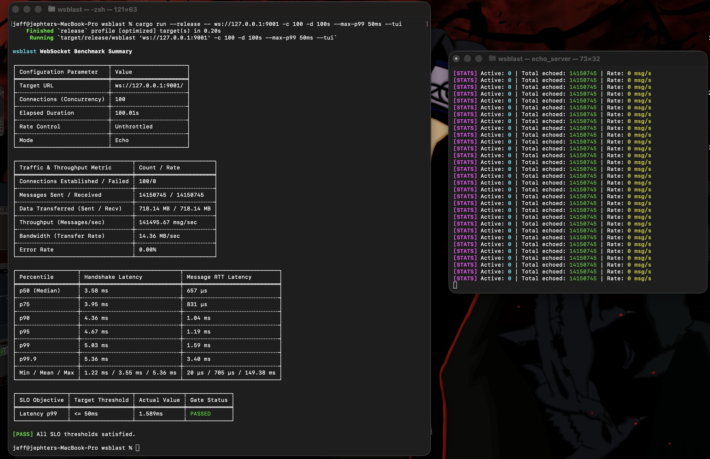

# wsblast

A high-performance WebSocket load testing CLI written in Rust.

* **Fast**: Zero-allocation hot paths and lock-free task-local metrics for maximum throughput.
* **Precise**: Monotonic microsecond latency percentiles (`p50`, `p90`, `p95`, `p99`, `p99.9`) using `HdrHistogram`.
* **CI-First**: Service Level Objective (SLO) gating with exit code `2` on budget breaches and markdown report generation.

[![Crates.io][crates-badge]][crates-url]
[![Build Status][actions-badge]][actions-url]
[![License: MIT][mit-badge]][mit-url]
[![Downloads][downloads-badge]][crates-url]

[crates-badge]: https://img.shields.io/crates/v/wsblast.svg
[crates-url]: https://crates.io/crates/wsblast
[actions-badge]: https://github.com/jephter-olamiposi/wsblast/actions/workflows/ci.yml/badge.svg
[actions-url]: https://github.com/jephter-olamiposi/wsblast/actions/workflows/ci.yml
[mit-badge]: https://img.shields.io/badge/license-MIT-blue.svg
[mit-url]: https://github.com/jephter-olamiposi/wsblast/blob/main/LICENSE
[downloads-badge]: https://img.shields.io/crates/d/wsblast.svg

## Overview

`wsblast` generates concurrent WebSocket load, measures round-trip latency distributions, and evaluates latency and error budgets in CI/CD pipelines.

Key capabilities:
* **Zero-Allocation Hot Path:** Pre-allocated frame buffers (`Utf8Bytes`, `Bytes`) avoid heap allocations in worker loops.
* **Lock-Free Concurrency:** Task-local latency histograms eliminate mutex contention across concurrent workers.
* **Connection Pacing:** Connection ramp rate (`--ramp-rate`) and request pacing (`--rate`) prevent SYN-flood queue drops and thundering-herd issues.
* **Failure Taxonomy:** Distinguishes DNS, TCP, TLS, HTTP 101 Upgrade rejection (`4xx`/`5xx`), protocol violations, timeouts, and unexpected closes.
* **Live Dashboard:** Interactive terminal UI powered by Ratatui with real-time throughput sparklines and active connection counters.
* **Multi-Format Reports:** Generates human-readable terminal tables, machine-readable JSON (schema v1.0), and GitHub Flavored Markdown.

---

## Installation

### Cargo (crates.io)
```bash
cargo install wsblast
```

### Pre-Compiled Binary (macOS & Linux)
Installs the pre-built binary for your OS and CPU architecture into `/usr/local/bin`:
```bash
curl -fsSL https://raw.githubusercontent.com/jephter-olamiposi/wsblast/main/install.sh | sh
```

### Docker
```bash
docker build -t wsblast .
docker run --rm -it wsblast wss://echo.websocket.org -c 20 -d 10s
```

### Direct Download
Standalone `.tar.gz` and `.zip` packages for Linux, macOS (Apple Silicon & Intel), and Windows are available on the [Releases](https://github.com/jephter-olamiposi/wsblast/releases) page.

---

## Quick Start

Run a 10-second test with 50 concurrent connections against an echo endpoint:
```bash
wsblast ws://127.0.0.1:9001 -c 50 -d 10s
```

Launch the interactive terminal dashboard (TUI):
```bash
wsblast ws://127.0.0.1:9001 -c 100 -d 30s --tui
```

Enforce latency and error rate budgets:
```bash
wsblast ws://127.0.0.1:9001 -c 50 -d 15s --max-p99 25ms --max-error-rate 0.01
```

---

## Architecture


```mermaid
flowchart LR
    subgraph ControlPlane["Control Plane"]
        A["CLI Arguments"] --> B["Config Validator"]
        B --> C["Runner"]
        C --> D["SLO Evaluator"]
    end

    subgraph DataPlane["Data Plane"]
        C --> E["Worker Pool (Tokio)"]
        E --> F["WebSocket Target\n(ws:// or wss://)"]
        E --> G["Task-Local HDR Histograms & Atomics"]
    end

    G --> H["Histogram Merge"]
    H --> I["Terminal Table"]
    H --> J["Schema v1.0 JSON"]
    H --> K["Markdown Report"]
    I --> D
    J --> D
    K --> D
    D --> L["Exit Code\n(0 = Pass, 1 = Error, 2 = SLO Breach)"]
```

---

## Terminal Dashboard (TUI)

Pass `--tui` to launch an interactive live dashboard powered by Ratatui:



---

## Benchmark Report

At completion, `wsblast` renders a percentile latency breakdown and SLO evaluation:



---

## CI/CD Pipeline Integration

`wsblast` returns exit code `2` on SLO breaches, making it suitable for CI/CD performance regression gates.

```yaml
name: Performance Gate

on: [push, pull_request]

jobs:
  websocket-gate:
    runs-on: ubuntu-latest
    steps:
      - uses: actions/checkout@v4

      - name: Install wsblast
        run: curl -fsSL https://raw.githubusercontent.com/jephter-olamiposi/wsblast/main/install.sh | sh

      - name: Run Performance Gate
        run: |
          wsblast wss://staging.example.com/ws \
            -c 50 \
            -d 15s \
            --max-p99 30ms \
            --max-error-rate 0.005 \
            --format markdown \
            --no-progress \
            -o report.md

      - name: Attach Summary to PR
        if: always()
        run: cat report.md >> $GITHUB_STEP_SUMMARY
```

---

## Command-Line Reference

```text
wsblast [OPTIONS] [URL]
```

### Core Options

| Option | Default | Description |
| :--- | :--- | :--- |
| `URL`, `-u, --url` | *Required* | Target WebSocket endpoint (`ws://` or `wss://`) |
| `-c, --connections` | `50` | Number of concurrent WebSocket connection workers |
| `--ramp-rate` | `0` | Connection ramp rate in workers/sec (`0` = unthrottled burst) |
| `-d, --duration` | `10s` | Test duration (e.g. `10s`, `30s`, `2m`, `500ms`) |
| `-n, --requests` | `None` | Total message limit across all workers |
| `-r, --rate` | `0` | Message rate per connection per second (`0` = unthrottled) |
| `-p, --payload` | JSON payload | Inline text payload (supports `{{timestamp}}`, `{{worker_id}}`, `{{seq}}`) |
| `--payload-file` | `None` | Path to file containing payload |
| `--binary` | `false` | Send payload as binary frames instead of text |
| `-H, --header` | `None` | Custom HTTP header (e.g. `-H "Authorization: Bearer token"`) |
| `--subprotocol` | `None` | WebSocket subprotocol (e.g. `graphql-transport-ws`) |
| `--mode` | `echo` | Execution mode: `echo` (RTT round-trip), `stream` (dispatch-only), `listen` |
| `--connect-timeout` | `5s` | Timeout for establishing TCP+TLS+WS upgrade handshake |
| `--message-timeout` | `5s` | Per-message response timeout in echo mode |
| `--ping-interval` | `0s` | Heartbeat ping interval (`0s` = disabled) |
| `--tui` | `false` | Launch interactive terminal dashboard |
| `--format` | `text` | Output report format: `text`, `json`, `markdown` |
| `-o, --output` | `None` | File path to write report output |
| `--no-progress` | `false` | Suppress progress bar (recommended for CI logs) |

### SLO Gating Options

| Option | Description |
| :--- | :--- |
| `--max-p50 <DURATION>` | Maximum acceptable p50 (median) round-trip latency (e.g. `5ms`, `500us`) |
| `--max-p95 <DURATION>` | Maximum acceptable p95 round-trip latency (e.g. `20ms`) |
| `--max-p99 <DURATION>` | Maximum acceptable p99 round-trip latency (e.g. `50ms`) |
| `--max-p999 <DURATION>` | Maximum acceptable p99.9 round-trip latency (e.g. `100ms`) |
| `--max-error-rate <FLOAT>` | Maximum acceptable error rate fraction (e.g. `0.01` for 1%) |
| `--min-throughput <RPS>` | Minimum required message throughput (messages/sec) |

---

## Exit Codes

| Code | Status | Description |
| :--- | :--- | :--- |
| `0` | **Success** | Test completed successfully and all configured SLO thresholds passed. |
| `1` | **Failure** | Runtime error (unreachable host, invalid configuration, fatal I/O error). |
| `2` | **SLO Breach** | Benchmark completed, but one or more SLO thresholds were violated. |

---

## License

MIT. See [LICENSE](LICENSE).
