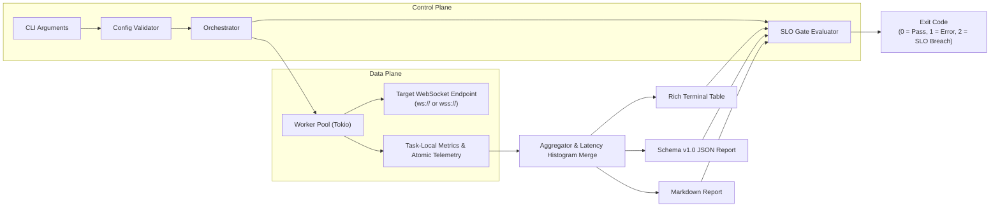

# wsblast

[](https://crates.io/crates/wsblast)
[](https://github.com/jephter-olamiposi/wsblast/actions/workflows/ci.yml)
[](LICENSE)
[](https://crates.io/crates/wsblast)

`wsblast` is a high-performance, Rust-native WebSocket load testing CLI designed for reproducible local-to-CI benchmarking, microsecond-accurate percentile latency tracking (`p50`, `p90`, `p95`, `p99`, `p99.9`), granular failure taxonomy, interactive terminal dashboards (TUI), and automated Service Level Objective (SLO) gating.

---

## Why wsblast

While stress-testing real-time WebSocket infrastructures, standard HTTP load testers fail to capture persistent connection lifecycle dynamics, framing overhead, and bidirectional round-trip latency variations.

`wsblast` provides:
- **Zero-Allocation Hot Path:** Pre-allocated cached static frames and task-local HDR histograms ensure zero mutex contention and zero heap allocation during high-throughput message loops.
- **Monotonic High-Resolution Timing:** Microsecond-resolution latency measurement immune to wall-clock skew or NTP stepping.
- **Connection Ramp Pacing:** Optional `--ramp-rate` prevents kernel SYN-flood queue drops and thundering herd spikes when establishing thousands of connections.
- **Granular Error Taxonomy:** Isolates connection failures into DNS, TCP connect, TLS handshakes, HTTP upgrade rejections (`4xx`/`5xx`), protocol violations, timeouts, and unexpected closes.
- **CI/CD SLO Gating:** Enforces latency budgets and error rate thresholds, returning exit code `2` on SLO violations for automated pipeline gating.
- **Schema-Versioned Machine Reports:** Exports structured JSON (`schema_version: "1.0.0"`) and GitHub Flavored Markdown tables for PR summaries.
- **Interactive Live Dashboard (TUI):** Real-time terminal visualization of throughput, active connections, and error feeds powered by Ratatui.

---

## Architecture


```mermaid
flowchart LR
    subgraph ControlPlane["Control Plane"]
        A["CLI Arguments"] --> B["Config Validator"]
        B --> C["Orchestrator"]
        C --> D["SLO Gate Evaluator"]
    end

    subgraph DataPlane["Data Plane"]
        C --> E["Worker Pool (Tokio)"]
        E --> F["Target WebSocket Endpoint\n(ws:// or wss://)"]
        E --> G["Task-Local Metrics & Atomic Telemetry"]
    end

    G --> H["Aggregator & Latency Histogram Merge"]
    H --> I["Rich Terminal Table"]
    H --> J["Schema v1.0 JSON Report"]
    H --> K["Markdown Report"]
    I --> D
    J --> D
    K --> D
    D --> L["Exit Code\n(0 = Pass, 1 = Error, 2 = SLO Breach)"]
```

---

## Installation

### Cargo (Rust Developers)
Install directly from crates.io:
```bash
cargo install wsblast
```

### One-Line Install (macOS & Linux)
No Rust required. Installs the pre-compiled binary for your CPU and OS into `/usr/local/bin`:
```bash
curl -fsSL https://raw.githubusercontent.com/jephter-olamiposi/wsblast/main/install.sh | sh
```

### Docker
Run via Docker without installing anything on your host system:
```bash
docker build -t wsblast .
docker run --rm -it wsblast wss://echo.websocket.org -c 20 -d 10s
```

### Pre-Built Binaries
Download standalone `.tar.gz` and `.zip` archives for Linux, macOS (Apple Silicon & Intel), and Windows from the [Releases](https://github.com/jephter-olamiposi/wsblast/releases) page.

---

## Quick Start

### Build from Source
```bash
git clone https://github.com/jephter-olamiposi/wsblast.git
cd wsblast
cargo build --release
```

### Run Local Echo Server Benchmark
In one terminal, start the built-in benchmark echo server:
```bash
cargo run --example echo_server
```

In another terminal, run `wsblast`:
```bash
# 50 concurrent connections, 10s duration, with p99 latency SLO gating
cargo run --release -- ws://127.0.0.1:9001 -c 50 -d 10s --max-p99 50ms
```

### Interactive Live Terminal Dashboard (TUI)
```bash
cargo run --release -- ws://127.0.0.1:9001 -c 100 -d 30s --tui
```

---

## Command-Line Usage

```text
wsblast [OPTIONS] [URL]
```

### Core Flags & Options

| Flag / Option | Default | Description |
| :--- | :--- | :--- |
| `URL`, `-u, --url` | *Required* | Target WebSocket endpoint (`ws://` or `wss://`) |
| `-c, --connections` | `50` | Number of concurrent WebSocket connection workers |
| `--ramp-rate` | `0` | Connection ramp rate in workers/sec (`0` = unthrottled burst) |
| `-d, --duration` | `10s` | Test duration (e.g. `10s`, `30s`, `2m`, `500ms`) |
| `-n, --requests` | `None` | Total message request limit across all workers |
| `-r, --rate` | `0` | Message rate per connection per sec (`0` = unthrottled blast) |
| `-p, --payload` | JSON payload | Inline text payload (supports `{{timestamp}}`, `{{worker_id}}`, `{{seq}}`) |
| `--payload-file` | `None` | Path to file containing payload data |
| `--binary` | `false` | Send payload as binary frames instead of text frames |
| `-H, --header` | `None` | Custom HTTP headers for handshake (e.g. `-H "Authorization: Bearer token"`) |
| `--subprotocol` | `None` | WebSocket subprotocol (e.g. `graphql-transport-ws`) |
| `--mode` | `echo` | Execution mode: `echo` (RTT round-trip), `stream` (fire-and-forget), `listen` |
| `--connect-timeout` | `5s` | Timeout for establishing TCP+TLS+WS upgrade handshake |
| `--message-timeout` | `5s` | Per-message response timeout in echo mode |
| `--ping-interval` | `0s` | Heartbeat ping interval (`0s` = disabled) |
| `--tui` | `false` | Launch interactive terminal user interface dashboard |
| `--format` | `text` | Output report format: `text`, `json`, `markdown` |
| `-o, --output` | `None` | Path to save output report file |
| `--no-progress` | `false` | Disable progress bar (recommended for CI logs) |

### CI/CD SLO Gating Options

| SLO Flag | Description |
| :--- | :--- |
| `--max-p50 <DURATION>` | Maximum acceptable p50 (median) round-trip latency (e.g. `5ms`, `500us`) |
| `--max-p95 <DURATION>` | Maximum acceptable p95 round-trip latency (e.g. `20ms`) |
| `--max-p99 <DURATION>` | Maximum acceptable p99 round-trip latency (e.g. `50ms`) |
| `--max-p999 <DURATION>` | Maximum acceptable p99.9 round-trip latency (e.g. `100ms`) |
| `--max-error-rate <FLOAT>` | Maximum acceptable error rate fraction (e.g. `0.01` for 1% error budget) |
| `--min-throughput <RPS>` | Minimum required message throughput (messages/sec) |

---

## Example Output

### Real-Time Interactive Terminal Dashboard (TUI)
Real-time throughput sparkline, live connection counters, and bandwidth tracking during an active benchmark:


### Benchmark Summary Report & SLO Gate Evaluation
Final summary table with percentile latency distribution (`p50`–`p99.9`) and automated SLO pass/fail gate:


---

## CI/CD Pipeline Integration (GitHub Actions)

```yaml
name: WebSocket Performance Gate

on: [push, pull_request]

jobs:
  wsblast-gate:
    runs-on: ubuntu-latest
    steps:
      - uses: actions/checkout@v4

      - name: Install Rust
        uses: dtolnay/rust-toolchain@stable

      - name: Start Target Service
        run: cargo run --example echo_server & sleep 2

      - name: Run wsblast Benchmark & Gate
        run: |
          cargo run --release -- \
            ws://127.0.0.1:9001 \
            -c 50 \
            -d 15s \
            --max-p99 25ms \
            --max-error-rate 0.005 \
            --format markdown \
            --no-progress \
            -o report.md

      - name: Attach Summary to PR
        if: always()
        run: cat report.md >> $GITHUB_STEP_SUMMARY
```

---

## Exit Codes

- `0`: Success (all tests executed and all SLO thresholds passed).
- `1`: Execution error (invalid configuration, unreachable host, or fatal runtime I/O failure).
- `2`: SLO threshold breached (one or more configured latency or error budgets violated).

---

## License

MIT. See [LICENSE](LICENSE).
